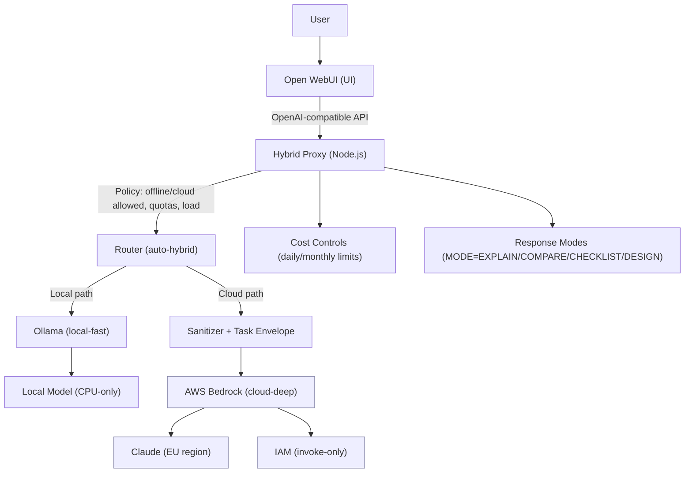

# Hybrid LLM Architecture (Lite)

Offline-first hybrid LLM setup that routes requests between:
- **Local**: Ollama (CPU-only, offline-capable)
- **Cloud**: AWS Bedrock (Anthropic Claude) for stronger reasoning when needed

This repo is designed as a **template/reference implementation**. Treat all user inputs as confidential by default.

## Project status

Pre-beta. Demo purposes only.

## Key features

- **Hybrid routing**
  - `local-fast`: always local (Ollama)
  - `cloud-deep`: always cloud (Bedrock)
  - `auto-hybrid`: policy-based routing (local by default, cloud when allowed/needed)
- **Mode-based response control** (prompt-level)
  - `MODE=EXPLAIN` (default): short conceptual answers
  - `MODE=COMPARE`: trade-offs + recommendation
  - `MODE=CHECKLIST`: steps only
  - `MODE=DESIGN`: architecture/security/IAM/data-flow
- **Data handling guardrails**
  - Local→cloud transfer via a **sanitized task envelope**
  - No “web browsing” claims unless explicitly enabled by the envelope
- **Cost controls**
  - Daily/monthly cloud request limits (configurable)
- **EU-only cloud**
  - Intended for Bedrock usage in EU regions (configure via env)

## Non-goals

- Not a turnkey “SaaS” product
- Not a substitute for organizational security review
- Not a guarantee against misconfiguration (you must configure secrets, logging, and network boundaries safely)

## Architecture overview

- Open WebUI (UI) talks to an **OpenAI-compatible** endpoint exposed by the `hybrid-proxy`
- The proxy decides where to send the request (local vs cloud) and applies:
  - policy checks (offline required, cloud allowed, load threshold, quotas)
  - response-mode extraction (`MODE=...`)
  - sanitization before any cloud request

## Architecture diagram (high level)

## Quick start (development)

### Prerequisites
- Docker / Docker Compose
- AWS credentials with **minimal invoke-only** permissions for Bedrock (cloud path only)
- Ollama running (local path)

### Environment variables
Configure via Compose env or an `.env` file (recommended). Do **not** commit secrets.

Common variables used by the proxy:
- `PROXY_API_KEY`
- `AWS_REGION`
- `BEDROCK_MODEL_ID`
- `OLLAMA_BASE_URL`
- `OLLAMA_LOCAL_MODEL`
- `CLOUD_ALLOWED`, `OFFLINE_REQUIRED`
- `CLOUD_DAILY_LIMIT`, `CLOUD_MONTHLY_LIMIT`
- `LOAD_FORCE_CLOUD_THRESHOLD`

### Run
1. Start Ollama (local)
2. Start the proxy + Open WebUI stack (compose/stack)
3. In Open WebUI, select one of:
   - `local-fast`
   - `auto-hybrid`
   - `cloud-deep`

## Using response modes

Prefix your prompt with one of these:
- `MODE=EXPLAIN` — short answer (default if omitted)
- `MODE=COMPARE` — pros/cons + recommendation
- `MODE=CHECKLIST` — steps only
- `MODE=DESIGN` — full architecture/security/IAM/data flow

Examples:
- `MODE=EXPLAIN What is idempotence?`
- `MODE=COMPARE REST vs gRPC for internal services`
- `MODE=CHECKLIST Steps to add a second Bedrock model`
- `MODE=DESIGN Hybrid routing + sanitization strategy`

## Security and privacy

See:
- `SECURITY.md` for disclosure/reporting guidance
- Docs in `docs/` for operational recommendations

Minimum recommendations for public use:
- Keep `PROXY_API_KEY` secret
- Avoid sending confidential data to cloud
- Disable any web search features unless explicitly intended
- Decide on logging/retention up front (and keep it minimal)

## License

MIT — see `LICENSE`.
